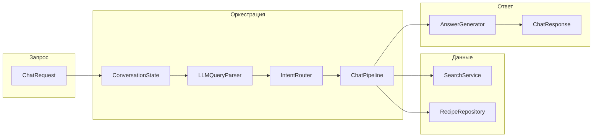

# Архитектура Food Helper

Краткий справочник по текущей реализации backend (`app/`). Детали LLM-ответа см. [llm-answer-generator-mvp.md](llm-answer-generator-mvp.md).

## Принцип

Система — **deterministic-first пайплайн**: поиск, фильтры и структура ответа API задаются кодом и данными из PostgreSQL. LLM используется только там, где это явно включено настройками: формулировка текста ответа (`AnswerGenerator`) и опционально разбор пользовательского запроса (`LLMQueryParser`).

## Поток обработки `POST /v1/chat`

1. **Состояние диалога** — [`ConversationStateService`](../app/services/conversation_state.py): `conversation_id`, история сообщений, последние результаты поиска, выбранный рецепт.
2. **Уточнения** — при активном уточнении [`ClarificationManager`](../app/orchestrator/clarification.py) может разрешить запрос без повторного полного прохода.
3. **Парсер запроса** — [`LLMQueryParser`](../app/services/llm/query_parser.py) в режимах `rules` / `llm` / `auto` (см. [query-parser.md](query-parser.md)); результат сливается с rule-based ограничениями через [`ParsedRequestAdapter`](../app/orchestrator/parsed_request_adapter.py).
4. **Интент** — [`IntentRouter.decide`](../app/orchestrator/intent_router.py): выбор `intent`, `route` и флагов retrieval (vector/SQL/контекст).
5. **Исполнение** — [`ChatPipeline.handle_chat`](../app/orchestrator/pipeline.py): поиск ([`SearchService`](../app/services/search_service.py), [`VectorSearchService`](../app/services/vector_search.py)), меню событий ([`MenuComposer`](../app/services/menu_composer.py)), замены, калории и т.д.
6. **Ответ** — [`AnswerGenerator`](../app/services/answer_generator.py): шаблон или LLM поверх уже собранного контекста; post-check по политике в [`postcheck.py`](../app/services/llm/postcheck.py).

## Интенты и маршруты

Типы задаются в [`IntentDecision`](../app/schemas/chat.py).

**Интенты (`intent`):** `search_recipes`, `recommend_recipes`, `event_recommendation`, `nutrition_question`, `ingredient_substitution`, `general_substitution`, `recipe_details`, `similar_recipes`, `allergy_or_exclusion`, `conversation_recall`, `fallback`.

**Маршруты (`route`):** `no_retrieval`, `sql`, `vector_search`, `hybrid_search`, `event_menu_recommendation`, `conversation_recipe_fetch`, `conversation_history`, `substitution`, `substitution_catalog`, `clarification`.

Событийное меню: интент `event_recommendation`, маршрут `event_menu_recommendation` — см. [event-menu.md](event-menu.md).

## Ключевые каталоги

| Путь | Роль |
|------|------|
| [`app/orchestrator/`](../app/orchestrator/) | Роутинг, пайплайн, извлечение события, ограничения запроса |
| [`app/services/`](../app/services/) | Поиск, репозиторий рецептов, замены, калории, LLM-клиенты |
| [`app/schemas/`](../app/schemas/) | Pydantic-схемы API и внутренних структур |
