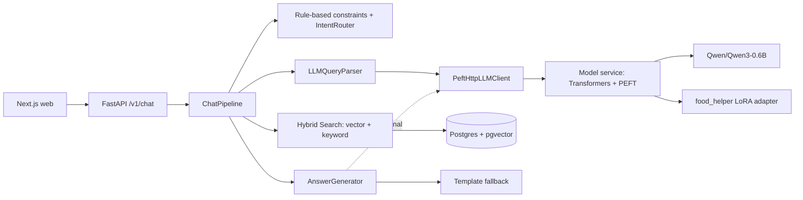

# ТЗ: внедрение LoRA-модели в Food Helper

**Проект:** `ShirinKhan1/food_helper`  
**Артефакт модели:** `food_helper_lora_adapter.zip`  
**Дата подготовки:** 2026-05-09  
**Цель документа:** описать техническое задание на внедрение загруженного PEFT LoRA-адаптера в текущую архитектуру Food Helper без нарушения deterministic-first пайплайна поиска, фильтрации и формирования структуры API-ответа.

---

## 1. Краткое резюме

Текущий проект Food Helper — API-сервис рецептов с гибридным поиском, Postgres/pgvector, FastAPI backend, Next.js frontend, историей чатов и опциональным LLM-слоем. В backend уже есть точки расширения для LLM:

- `LLMQueryParser` — опциональный структурный парсер пользовательского запроса;
- `AnswerGenerator` — опциональная генерация человекочитаемого поля `ChatResponse.answer` поверх уже собранного deterministic-контекста;
- `LLMClient` protocol — единый интерфейс генерации;
- текущий provider — `ollama`, вызываемый через HTTP `/api/generate`.

Загруженный файл является **не полной моделью**, а **PEFT LoRA-адаптером** для базовой модели `Qwen/Qwen3-0.6B`. По metadata задача адаптера указана как `food_helper_decision_planner`, поэтому рекомендуемый MVP-вариант внедрения — использовать адаптер прежде всего как **LLM-парсер/планировщик запроса** в `LLMQueryParser`, а не как основной генератор финальных ответов пользователю.

Рекомендуемая архитектура внедрения: добавить отдельный **model service** на Hugging Face Transformers + PEFT и подключить его к backend через новый provider `peft_http`. Это снижает риск раздувания основного API-контейнера и сохраняет текущие fallback-механизмы.

---

## 2. Изученный артефакт модели

### 2.1. Состав архива

| Файл | Назначение |
|---|---|
| `adapter_model.safetensors` | LoRA-веса адаптера |
| `adapter_config.json` | PEFT-конфигурация адаптера |
| `tokenizer.json` | tokenizer artifact |
| `tokenizer_config.json` | конфигурация tokenizer |
| `chat_template.jinja` | chat-template для Qwen-style сообщений |
| `food_helper_metadata.json` | metadata проекта/задачи |
| `README.md` | model card template |

### 2.2. Параметры модели из `food_helper_metadata.json`

| Параметр | Значение |
|---|---|
| `artifact_type` | `peft_lora_adapter` |
| `base_model_name` | `Qwen/Qwen3-0.6B` |
| `task` | `food_helper_decision_planner` |
| `schema_version` | `v1` |
| `saved_at` | `2026-05-09T19:00:45.632667Z` |

### 2.3. PEFT/LoRA-конфигурация из `adapter_config.json`

| Параметр | Значение |
|---|---|
| `peft_type` | `LORA` |
| `task_type` | `CAUSAL_LM` |
| `base_model_name_or_path` | `Qwen/Qwen3-0.6B` |
| `peft_version` | `0.19.1` |
| `r` | `16` |
| `lora_alpha` | `32` |
| `lora_dropout` | `0.05` |
| `bias` | `none` |
| `inference_mode` | `true` |
| `target_modules` | `q_proj`, `k_proj`, `v_proj`, `o_proj`, `gate_proj`, `up_proj`, `down_proj` |

### 2.4. Tokenizer/config особенности

| Параметр | Значение |
|---|---|
| `tokenizer_class` | `Qwen2Tokenizer` |
| `eos_token` | `<|im_end|>` |
| `pad_token` | `<|endoftext|>` |
| `model_max_length` | `131072` |
| специальные токены | `<|im_start|>`, `<|im_end|>`, vision/object tokens |

Для runtime не требуется использовать полный `model_max_length`; для текущего API разумный дефолт — `4096`, как уже используется в настройках LLM Food Helper.

### 2.5. Контрольные суммы артефакта

| Файл | SHA256 |
|---|---|
| `food_helper_lora_adapter.zip` | `bce9b0a2c7622f2f5f3e38be453dc95877fdc530eaf462554769cb6add4bf21e` |
| `adapter_model.safetensors` | `c0b0c45753843d3df0f916c56a58aae9ffec851eae693b74e7eee2e94d0d27d9` |
| `adapter_config.json` | `51b3e08b3af89f9e0f05e263a9a56911c9025fe637f8dac6693fb61d173bd2b6` |
| `tokenizer.json` | `be75606093db2094d7cd20f3c2f385c212750648bd6ea4fb2bf507a6a4c55506` |

---

## 3. Текущее состояние проекта

### 3.1. Backend

Текущий backend построен вокруг `POST /v1/chat`:

1. `routes_chat.py` валидирует входной `ChatRequest` и вызывает `services.chat_pipeline.handle_chat(...)`.
2. `ChatPipeline.handle_chat(...)` сохраняет сообщение, достаёт state диалога, запускает rule-based ограничения, intent router и опциональный `LLMQueryParser`.
3. `LLMQueryParser` работает в режимах `rules`, `llm`, `auto` и при ошибках возвращает fallback на rule-based результат.
4. `ParsedRequestAdapter` преобразует результат парсера в `IntentDecision`, `QueryConstraints`, `message_for_search`.
5. `SearchService` / `VectorSearchService` / `KeywordSearchService` выполняют поиск.
6. `AnswerGenerator` может оставить rule-based template answer или вызвать LLM только поверх уже подготовленного контекста.

### 3.2. Существующий LLM-интерфейс

Сейчас LLM-клиенты приводятся к интерфейсу:

```python
@dataclass(frozen=True)
class LLMGenerateRequest:
    system_prompt: str
    user_prompt: str
    temperature: float = 0.2
    max_tokens: int = 500
    num_ctx: int = 4096
    think: bool = False

class LLMClient(Protocol):
    def generate(self, request: LLMGenerateRequest) -> str:
        ...
```

Текущий `OllamaLLMClient` отправляет `system`, `prompt`, `think` и `options` в Ollama `/api/generate`. PEFT LoRA-адаптер напрямую через этот клиент не загрузить: Ollama работает с именами моделей/Modelfile, а загруженный артефакт является Hugging Face PEFT-адаптером. Для Ollama-пути нужен отдельный процесс merge/export/convert, что не является оптимальным MVP.

### 3.3. Существующие режимы

| Область | Настройки |
|---|---|
| Парсер запроса | `QUERY_PARSER_MODE=rules|llm|auto`, `LLM_QUERY_PARSER_ENABLED=true|false` |
| Ответ пользователю | `ANSWER_MODE=template|llm|auto`, `LLM_ENABLED=true|false` |
| Провайдер сейчас | `LLM_PROVIDER=ollama`, `LLM_QUERY_PARSER_PROVIDER=ollama` |
| Fallback | при timeout/exception/invalid JSON/postcheck failure API продолжает работать без LLM |

---

## 4. Цели внедрения

### 4.1. Главная цель

Внедрить LoRA-адаптер `food_helper_decision_planner` в Food Helper так, чтобы он мог использоваться как структурный LLM-планировщик/парсер пользовательских запросов в текущем чат-пайплайне.

### 4.2. Дополнительные цели

- сохранить deterministic-first принцип: поиск, hard filters, аллергены, ограничения, источники и структура ответа не должны определяться моделью;
- обеспечить быстрый rollback на `QUERY_PARSER_MODE=rules` и `ANSWER_MODE=template`;
- добавить observability: latency, fallback reason, provider/model name, model health;
- не ломать web frontend и текущий контракт `ChatResponse`;
- не коммитить большие model artifacts в обычный git без Git LFS или внешнего хранилища.

### 4.3. Не цели MVP

- переобучение модели;
- замена гибридного поиска на генеративный RAG;
- доверие модели в вопросах аллергенов/медицинской безопасности;
- генерация новых рецептов, которых нет в базе;
- обязательная конвертация LoRA в GGUF/Ollama;
- изменение UX фронтенда, кроме возможного отображения debug/status в dev-режиме.

---

## 5. Рекомендуемая архитектура

### 5.1. Вариант MVP: отдельный PEFT model service



### 5.2. Почему отдельный сервис

| Причина | Обоснование |
|---|---|
| Изоляция ресурсов | Qwen3 + PEFT runtime не должен раздувать API-контейнер и мешать embedding/search части. |
| Простая интеграция | Backend уже умеет HTTP-клиенты для LLM. Добавляется provider без переписывания пайплайна. |
| Fallback | Если model service недоступен, API остаётся работоспособным через rules/template. |
| Масштабирование | Model service можно отдельно переносить на GPU/CPU, менять memory limits, перезапускать. |
| Отладка | Отдельный `/health` и `/generate` упрощают диагностику модели. |

### 5.3. Альтернативный вариант

Загрузить base model + adapter прямо внутри API-контейнера через новый `HFPeftLLMClient`. Этот вариант допустим для локального прототипа, но хуже для Docker/production из-за памяти, времени старта и смешения обязанностей API и inference runtime.

---

## 6. Функциональные требования

### FR-001. Размещение артефакта модели

1. Создать директорию:

```text
models/
  food_helper_lora_adapter/
    adapter_model.safetensors
    adapter_config.json
    tokenizer.json
    tokenizer_config.json
    chat_template.jinja
    food_helper_metadata.json
    README.md
```

2. Добавить `models/` в `.gitignore`, если артефакты не ведутся через Git LFS.
3. Для production предусмотреть один из способов доставки:
   - Git LFS;
   - private Hugging Face repo;
   - Docker volume;
   - CI artifact;
   - S3/MinIO/object storage.
4. Базовую модель `Qwen/Qwen3-0.6B` не хранить в обычном git. Она должна скачиваться в Docker build/cache или монтироваться как volume.

### FR-002. Новый model service

Создать сервис, например:

```text
model_server/
  __init__.py
  main.py
  runtime.py
  schemas.py
  settings.py
```

Model service должен:

- загружать tokenizer;
- загружать `AutoModelForCausalLM` для `Qwen/Qwen3-0.6B`;
- подключать LoRA через PEFT;
- держать модель в памяти после startup;
- отдавать `GET /health`;
- принимать `POST /generate`;
- возвращать plain text response и метрики latency/tokens;
- корректно обрабатывать timeout/exception без падения процесса.

### FR-003. API model service: `/health`

**Request:** нет.  
**Response:**

```json
{
  "status": "ok",
  "model_loaded": true,
  "base_model": "Qwen/Qwen3-0.6B",
  "adapter_path": "/opt/models/food_helper_lora_adapter",
  "adapter_task": "food_helper_decision_planner",
  "device": "cpu|cuda",
  "dtype": "auto|float32|float16|bfloat16",
  "max_input_tokens": 4096
}
```

### FR-004. API model service: `/generate`

**Request:** совместим с текущим `LLMGenerateRequest`.

```json
{
  "system_prompt": "...",
  "user_prompt": "...",
  "temperature": 0.0,
  "max_tokens": 700,
  "num_ctx": 4096,
  "think": false,
  "stop": []
}
```

**Response:**

```json
{
  "response": "...",
  "model": "food-helper-qwen3-0.6b-lora",
  "base_model": "Qwen/Qwen3-0.6B",
  "used_adapter": true,
  "latency_ms": 1234,
  "prompt_tokens": 512,
  "completion_tokens": 128
}
```

### FR-005. Prompt formatting

Model service должен собирать chat prompt через tokenizer chat template:

```python
messages = []
if request.system_prompt:
    messages.append({"role": "system", "content": request.system_prompt})
messages.append({"role": "user", "content": request.user_prompt})

text = tokenizer.apply_chat_template(
    messages,
    tokenize=False,
    add_generation_prompt=True,
    enable_thinking=request.think,
)
```

Для `LLMQueryParser` обязательно использовать:

- `temperature=0`;
- `think=false`;
- `max_tokens` около `700`;
- JSON-only prompt уже есть в `parser_prompts.py`;
- invalid JSON должен приводить к текущему fallback в `LLMQueryParser`.

### FR-006. Новый backend provider `peft_http`

Создать файл:

```text
app/services/llm/peft_http.py
```

Класс:

```python
class PeftHttpLLMClient:
    def __init__(self, *, base_url: str, model: str, timeout_seconds: float): ...
    def generate(self, request: LLMGenerateRequest) -> str: ...
```

Требования:

- POST в `{base_url}/generate`;
- `response.raise_for_status()`;
- пустой `response` трактовать как ошибку;
- вернуть только строку `data["response"]`;
- сохранять совместимость с `LLMClient` protocol;
- не логировать полный prompt/response без явного debug-флага.

### FR-007. Расширение `Settings`

В `app/core/config.py` добавить provider-specific настройки.

Минимальный набор:

| Env | Назначение | Default |
|---|---|---|
| `LLM_PROVIDER` | provider для `AnswerGenerator`: `none|ollama|peft_http` | `none` или текущий default |
| `LLM_QUERY_PARSER_PROVIDER` | provider для `LLMQueryParser`: `ollama|peft_http` | `ollama` |
| `LLM_MODEL` | имя runtime-модели для answer generator | `qwen3:4b` или `food-helper-qwen3-0.6b-lora` |
| `LLM_QUERY_PARSER_MODEL` | имя runtime-модели для parser | `food-helper-qwen3-0.6b-lora` |
| `LLM_BASE_URL` | URL LLM provider для answer | `http://localhost:11434` |
| `LLM_QUERY_PARSER_BASE_URL` | URL provider для parser; если пусто — использовать `LLM_BASE_URL` | пусто |
| `LLM_QUERY_PARSER_TIMEOUT_SECONDS` | timeout parser request | `15` |
| `LLM_TIMEOUT_SECONDS` | timeout answer request | `90` |

Отдельный `LLM_QUERY_PARSER_BASE_URL` нужен, чтобы можно было одновременно использовать adapter для parser и Ollama/другую модель для answer.

### FR-008. Refactor provider selection в `container.py`

Вынести создание LLM-клиентов в функцию:

```python
def build_llm_client(
    *,
    provider: str,
    base_url: str,
    model: str,
    timeout_seconds: float,
) -> LLMClient | None:
    if provider == "ollama":
        return OllamaLLMClient(...)
    if provider == "peft_http":
        return PeftHttpLLMClient(...)
    return None
```

Использовать отдельно:

- `parser_llm_client` для `LLMQueryParser`;
- `answer_llm_client` для `AnswerGenerator`.

### FR-009. Режим MVP: adapter только для parser

Рекомендуемая конфигурация MVP:

```env
QUERY_PARSER_MODE=auto
LLM_QUERY_PARSER_ENABLED=true
LLM_QUERY_PARSER_PROVIDER=peft_http
LLM_QUERY_PARSER_MODEL=food-helper-qwen3-0.6b-lora
LLM_QUERY_PARSER_BASE_URL=http://model:8010
LLM_QUERY_PARSER_TEMPERATURE=0
LLM_QUERY_PARSER_MAX_TOKENS=700
LLM_QUERY_PARSER_NUM_CTX=4096
LLM_QUERY_PARSER_TIMEOUT_SECONDS=15
LLM_QUERY_PARSER_POSTCHECK_ENABLED=true

ANSWER_MODE=template
LLM_ENABLED=false
```

Такой режим позволяет проверить качество adapter-планировщика без риска испортить финальную формулировку ответа.

### FR-010. Опциональный режим: adapter для answer generator

Разрешить только после прохождения eval:

```env
ANSWER_MODE=auto
LLM_ENABLED=true
LLM_PROVIDER=peft_http
LLM_MODEL=food-helper-qwen3-0.6b-lora
LLM_BASE_URL=http://model:8010
LLM_TEMPERATURE=0.2
LLM_MAX_TOKENS=500
LLM_NUM_CTX=4096
LLM_THINK=false
LLM_POSTCHECK_ENABLED=true
LLM_STRICT_CONTEXT=true
```

Ограничение: adapter по metadata обучен как `food_helper_decision_planner`, поэтому его качество для natural language answer generation нужно проверять отдельно.

### FR-011. Healthcheck в API

Расширить `/health` backend, добавив необязательный блок:

```json
{
  "status": "ok",
  "db": "ok",
  "embedding_model": "ok",
  "llm": {
    "parser_provider": "peft_http",
    "parser_model": "food-helper-qwen3-0.6b-lora",
    "parser_health": "ok|error|disabled",
    "answer_provider": "none|ollama|peft_http",
    "answer_health": "ok|error|disabled"
  }
}
```

Если model service недоступен, `/health` может быть `degraded`, но `/v1/chat` не должен падать, если доступен fallback.

### FR-012. Debug-поля

При `include_debug=true` в ответе `/v1/chat` должны сохраняться текущие поля:

```json
"debug": {
  "parser": {
    "mode": "auto",
    "used_llm": true,
    "fallback_reason": null,
    "latency_ms": 1234,
    "postcheck_passed": true,
    "postcheck_errors": [],
    "parsed_request": {}
  },
  "llm": {
    "used_llm": false,
    "fallback_reason": "answer_mode_template"
  }
}
```

Добавить provider/model в debug, если это не ломает существующие тесты:

```json
"provider": "peft_http",
"model": "food-helper-qwen3-0.6b-lora"
```

### FR-013. Docker Compose

Добавить сервис `model`.

Пример:

```yaml
services:
  model:
    build:
      context: .
      dockerfile: docker/Dockerfile.model
    container_name: food_helper_model
    environment:
      MODEL_BASE_NAME: Qwen/Qwen3-0.6B
      MODEL_ADAPTER_PATH: /opt/models/food_helper_lora_adapter
      MODEL_NAME: food-helper-qwen3-0.6b-lora
      MODEL_DEVICE: auto
      MODEL_DTYPE: auto
      MODEL_MAX_INPUT_TOKENS: "4096"
      MODEL_ENABLE_THINKING_DEFAULT: "false"
      HF_HOME: /opt/hf_cache
    volumes:
      - ./models/food_helper_lora_adapter:/opt/models/food_helper_lora_adapter:ro
      - hf_cache:/opt/hf_cache
    ports:
      - "8010:8010"
    restart: unless-stopped

  api:
    environment:
      QUERY_PARSER_MODE: auto
      LLM_QUERY_PARSER_ENABLED: "true"
      LLM_QUERY_PARSER_PROVIDER: peft_http
      LLM_QUERY_PARSER_MODEL: food-helper-qwen3-0.6b-lora
      LLM_QUERY_PARSER_BASE_URL: http://model:8010
    depends_on:
      model:
        condition: service_started

volumes:
  hf_cache:
```

### FR-014. Dockerfile для model service

Создать `docker/Dockerfile.model`.

Минимальный вариант CPU:

```dockerfile
FROM python:3.12-slim

ENV PYTHONDONTWRITEBYTECODE=1 \
    PYTHONUNBUFFERED=1

WORKDIR /app

COPY requirements-llm.txt /app/requirements-llm.txt
RUN pip install --upgrade pip \
 && pip install --no-cache-dir --index-url https://download.pytorch.org/whl/cpu torch \
 && pip install --no-cache-dir -r /app/requirements-llm.txt

COPY model_server /app/model_server

CMD ["uvicorn", "model_server.main:app", "--host", "0.0.0.0", "--port", "8010"]
```

`requirements-llm.txt`:

```text
fastapi>=0.115.0
uvicorn>=0.32.0
httpx>=0.28.0
transformers>=4.51.0
peft==0.19.1
accelerate>=0.34.0
safetensors>=0.4.5
pydantic>=2.0.0
```

Версии нужно зафиксировать lock-файлом после smoke-теста на целевой машине.

---

## 7. Нефункциональные требования

### NFR-001. Надёжность и fallback

- Недоступность model service не должна приводить к HTTP 500 в `/v1/chat`.
- `LLMQueryParser` должен возвращать fallback на rules при:
  - timeout;
  - HTTP error;
  - пустом ответе;
  - invalid JSON;
  - schema validation error;
  - parser postcheck failure.
- `AnswerGenerator` должен возвращать template answer при любой ошибке LLM.

### NFR-002. Производительность

MVP-целевые ориентиры:

| Метрика | CPU target | GPU target |
|---|---:|---:|
| parser p50 latency | ≤ 4 сек | ≤ 1 сек |
| parser p95 latency | ≤ 12 сек | ≤ 3 сек |
| answer p95 latency, если включить | ≤ 25 сек | ≤ 8 сек |
| `/v1/chat` без model service | не хуже текущего rules/template режима |

Если CPU target не достигается, оставить `QUERY_PARSER_MODE=auto`, чтобы простые запросы не ходили в LLM.

### NFR-003. Память и ресурсы

- Базовая модель `Qwen/Qwen3-0.6B` на Hugging Face занимает примерно 1.5 GB model weights; runtime-память выше из-за tokenizer, activations и Python overhead.
- Для CPU-контейнера заложить минимум 4 GB RAM, рекомендовано 6–8 GB.
- Для GPU-режима добавить отдельный compose override с NVIDIA runtime.
- API-контейнер не должен загружать модель, если выбран вариант отдельного service.

### NFR-004. Безопасность

- Не логировать полный prompt/response по умолчанию.
- Не хранить секреты в model artifacts.
- Не позволять модели отменять hard filters и allergy exclusions.
- Не доверять модели медицинские гарантии.
- Не принимать от модели recipe_id, calories, БЖУ, ингредиенты или источники как истину; модель только структурирует запрос.

### NFR-005. Совместимость

- Существующий контракт `/v1/chat` должен сохраниться.
- Frontend не должен требовать изменений для MVP.
- Все текущие tests должны проходить.
- `ANSWER_MODE=template` и `QUERY_PARSER_MODE=rules` должны полностью отключать LLM-слой.

---

## 8. Контракт parser output

`LLMQueryParser` ожидает JSON, валидируемый через `ParsedUserRequest`.

Минимальная структура:

```json
{
  "intent": "search_recipes",
  "confidence": 0.9,
  "search_query": "ужин без молока",
  "constraints": {
    "dish": null,
    "include_ingredients": [],
    "exclude_ingredients": ["молоко"],
    "allergy_exclusions": [],
    "dietary_preference": null,
    "restriction_type": null,
    "meal_type": "dinner",
    "diet_goal": null,
    "max_calories_kcal": null,
    "min_protein_g": null,
    "max_fat_g": null,
    "max_cooking_time_minutes": null,
    "max_difficulty": null
  },
  "recipe_reference": null,
  "recipe_title_query": null,
  "target_ingredient": null,
  "nutrients": [],
  "event_profile": null,
  "requires_clarification": false,
  "clarification": null
}
```

Требования:

- output должен быть строго JSON без markdown;
- `confidence` в диапазоне `0..1`;
- `intent` только из whitelist;
- `meal_type` только `breakfast|lunch|dinner|snack|null`;
- numeric constraints в пределах Pydantic validators;
- если `requires_clarification=false`, `clarification=null`;
- если запрос ссылается на “первый/второй/этот рецепт”, заполнять `recipe_reference`;
- если контекста нет, выставлять clarification.

---

## 9. Изменения по файлам

| Файл/директория | Действие | Содержание |
|---|---|---|
| `models/food_helper_lora_adapter/` | создать | распакованный LoRA-адаптер |
| `.gitignore` | изменить | добавить `models/`, если без Git LFS |
| `requirements-llm.txt` | создать | зависимости model service |
| `model_server/settings.py` | создать | env-настройки модели |
| `model_server/schemas.py` | создать | Pydantic request/response для `/generate`, `/health` |
| `model_server/runtime.py` | создать | загрузка tokenizer/base model/PEFT adapter, генерация |
| `model_server/main.py` | создать | FastAPI app сервиса модели |
| `docker/Dockerfile.model` | создать | Docker image для model service |
| `docker-compose.yaml` | изменить | добавить service `model`, env для API |
| `app/services/llm/peft_http.py` | создать | HTTP provider к model service |
| `app/core/config.py` | изменить | новые env-настройки provider/base_url |
| `app/services/container.py` | изменить | provider factory для parser/answer клиентов |
| `app/main.py` | изменить опционально | расширить `/health` LLM-статусом |
| `docs/model-integration.md` | создать | инструкция запуска и диагностики |
| `README.md` | изменить | короткий раздел про model service |
| `tests/` | добавить | unit/integration/eval тесты |

---

## 10. Псевдокод реализации

### 10.1. `PeftHttpLLMClient`

```python
from __future__ import annotations

import httpx

from app.services.llm.base import LLMGenerateRequest


class PeftHttpLLMClient:
    def __init__(self, *, base_url: str, model: str, timeout_seconds: float = 15.0) -> None:
        self._base_url = base_url.rstrip("/")
        self._model = model
        self._timeout_seconds = timeout_seconds

    def generate(self, request: LLMGenerateRequest) -> str:
        payload = {
            "model": self._model,
            "system_prompt": request.system_prompt,
            "user_prompt": request.user_prompt,
            "temperature": request.temperature,
            "max_tokens": request.max_tokens,
            "num_ctx": request.num_ctx,
            "think": request.think,
        }
        with httpx.Client(timeout=self._timeout_seconds) as client:
            response = client.post(f"{self._base_url}/generate", json=payload)
            response.raise_for_status()
            data = response.json()
        answer = str(data.get("response") or "").strip()
        if not answer:
            raise RuntimeError("PEFT model service returned empty response.")
        return answer
```

### 10.2. Загрузка модели в `model_server/runtime.py`

```python
from transformers import AutoModelForCausalLM, AutoTokenizer
from peft import PeftModel
import torch


def load_runtime(settings):
    tokenizer_source = settings.adapter_path if settings.use_adapter_tokenizer else settings.base_model

    tokenizer = AutoTokenizer.from_pretrained(
        tokenizer_source,
        local_files_only=settings.local_files_only,
        trust_remote_code=False,
    )

    base = AutoModelForCausalLM.from_pretrained(
        settings.base_model,
        torch_dtype="auto",
        device_map="auto" if settings.device == "auto" else None,
        local_files_only=settings.local_files_only,
        trust_remote_code=False,
    )

    model = PeftModel.from_pretrained(
        base,
        settings.adapter_path,
        is_trainable=False,
        local_files_only=True,
    )
    model.eval()
    return tokenizer, model
```

### 10.3. Генерация

```python
def generate(tokenizer, model, request):
    messages = []
    if request.system_prompt:
        messages.append({"role": "system", "content": request.system_prompt})
    messages.append({"role": "user", "content": request.user_prompt})

    text = tokenizer.apply_chat_template(
        messages,
        tokenize=False,
        add_generation_prompt=True,
        enable_thinking=request.think,
    )

    inputs = tokenizer(
        text,
        return_tensors="pt",
        truncation=True,
        max_length=request.num_ctx,
    ).to(model.device)

    generation_kwargs = {
        "max_new_tokens": request.max_tokens,
        "do_sample": request.temperature > 0,
        "pad_token_id": tokenizer.pad_token_id or tokenizer.eos_token_id,
        "eos_token_id": tokenizer.eos_token_id,
    }
    if request.temperature > 0:
        generation_kwargs["temperature"] = max(request.temperature, 1e-5)

    with torch.inference_mode():
        output_ids = model.generate(**inputs, **generation_kwargs)

    new_tokens = output_ids[0][inputs["input_ids"].shape[-1]:]
    text = tokenizer.decode(new_tokens, skip_special_tokens=True).strip()
    return strip_think_tags(text)
```

---

## 11. Тестирование

### 11.1. Unit tests

| Тест | Проверка |
|---|---|
| `test_peft_http_client_success` | клиент отправляет payload и возвращает `response` |
| `test_peft_http_client_empty_response` | пустой response вызывает exception |
| `test_peft_http_client_http_error` | HTTP error приводит к exception и fallback выше по стеку |
| `test_build_llm_client_peft_http` | provider factory создаёт `PeftHttpLLMClient` |
| `test_query_parser_invalid_json_fallback` | invalid JSON от модели → fallback на rules |
| `test_query_parser_timeout_fallback` | timeout → `parser_llm_timeout` |
| `test_answer_generator_template_unchanged` | `ANSWER_MODE=template` не вызывает LLM |

### 11.2. Integration tests

Запуск:

```bash
docker compose build model api
docker compose up -d db model api
curl http://localhost:8010/health
curl http://localhost:8000/health
```

Проверочные запросы:

```bash
curl -X POST http://localhost:8000/v1/chat \
  -H "Content-Type: application/json" \
  -d '{"message":"Подбери ужин без молока и сахара до 500 ккал", "options":{"top_k":5,"include_debug":true}}'
```

```bash
curl -X POST http://localhost:8000/v1/chat \
  -H "Content-Type: application/json" \
  -d '{"message":"Что можно приготовить на день рождения на 6 человек без орехов?", "options":{"top_k":5,"include_debug":true}}'
```

```bash
curl -X POST http://localhost:8000/v1/chat \
  -H "Content-Type: application/json" \
  -d '{"message":"Покажи БЖУ второго рецепта", "options":{"top_k":5,"include_debug":true}}'
```

### 11.3. Eval parser качества

Расширить существующий eval-подход:

```bash
python scripts/eval/run_query_parser_eval.py
```

Добавить режимы:

```bash
QUERY_PARSER_MODE=rules python scripts/eval/run_query_parser_eval.py --output eval_rules.json
QUERY_PARSER_MODE=llm LLM_QUERY_PARSER_PROVIDER=peft_http python scripts/eval/run_query_parser_eval.py --output eval_peft.json
python scripts/eval/compare_query_parser_eval.py eval_rules.json eval_peft.json
```

Метрики:

| Метрика | Описание |
|---|---|
| `intent_accuracy` | совпадение intent с golden set |
| `route_accuracy` | совпадение route после adapter conversion |
| `constraint_f1_include` | F1 по include ingredients |
| `constraint_f1_exclude` | F1 по exclude ingredients |
| `allergy_recall` | recall allergy exclusions |
| `numeric_constraint_accuracy` | корректность calories/time/difficulty |
| `json_valid_rate` | доля валидных JSON outputs |
| `fallback_rate` | доля fallback случаев |
| `latency_p50/p95` | latency parser вызова |

Минимальные критерии MVP:

- `json_valid_rate >= 0.98`;
- `allergy_recall >= rules baseline`;
- hard filters не ухудшаются;
- `intent_accuracy >= rules baseline` на сложных запросах или явно лучше на subset сложных запросов;
- fallback не приводит к 500;
- latency укладывается в NFR targets или включён `QUERY_PARSER_MODE=auto`.

---

## 12. Acceptance criteria

Внедрение считается выполненным, если:

1. Архив адаптера распакован и model service стартует с ним.
2. `GET /health` model service возвращает `status=ok` и `model_loaded=true`.
3. Backend поддерживает `LLM_QUERY_PARSER_PROVIDER=peft_http`.
4. В режиме `QUERY_PARSER_MODE=auto` сложные запросы вызывают adapter, простые могут оставаться на rules.
5. `/v1/chat` сохраняет текущий JSON-контракт.
6. При недоступном model service `/v1/chat` не падает и использует fallback.
7. При `include_debug=true` видны `debug.parser.used_llm`, `fallback_reason`, `latency_ms`, `postcheck_passed`.
8. Все текущие unit/API тесты проходят.
9. Добавлены новые unit tests для `PeftHttpLLMClient` и provider selection.
10. Проведён parser eval и результаты сохранены в `docs/eval/` или `artifacts/eval/`.
11. Hard filters по исключениям и аллергенам не зависят от модели и применяются после parsing/search.
12. В README/docs описаны запуск, env, fallback и troubleshooting.
13. Есть rollback: `QUERY_PARSER_MODE=rules`, `ANSWER_MODE=template`, `LLM_ENABLED=false`.

---

## 13. Риски и меры снижения

| Риск | Вероятность | Влияние | Митигирующие действия |
|---|---:|---:|---|
| Adapter не подходит для финального answer generation | средняя | среднее | MVP использовать только для parser; answer включать после eval |
| Invalid JSON от модели | средняя | низкое | текущий fallback + schema validation + parser postcheck |
| Рост latency на CPU | высокая | среднее | `QUERY_PARSER_MODE=auto`, timeout, GPU override, smaller max tokens |
| Base model не скачивается в Docker | средняя | высокое | HF cache volume, pre-download image layer, offline artifact strategy |
| Память контейнера недостаточна | средняя | высокое | отдельный model service, memory limit, monitoring, CPU/GPU profiles |
| Модель нарушает allergy/exclude constraints | средняя | высокое | не доверять модели hard filters; merge with rules; post-filter final_results |
| Логирование prompt с пользовательскими данными | низкая | среднее | debug logs off by default; redaction при включении |
| Несовместимость PEFT/Transformers | средняя | среднее | pin versions, smoke test, lock file |
| Случайный commit больших файлов | средняя | среднее | `.gitignore`, Git LFS, pre-commit check |

---

## 14. План внедрения

### Этап 1. Подготовка артефакта

- Распаковать adapter в `models/food_helper_lora_adapter/`.
- Добавить checksums в `docs/model-artifacts.md`.
- Решить способ хранения base model и adapter.
- Обновить `.gitignore` или настроить Git LFS.

### Этап 2. Model service

- Создать `model_server/`.
- Реализовать `settings.py`, `schemas.py`, `runtime.py`, `main.py`.
- Добавить `GET /health`, `POST /generate`.
- Добавить `requirements-llm.txt`.
- Добавить `docker/Dockerfile.model`.
- Провести smoke test локально.

### Этап 3. Backend provider

- Создать `app/services/llm/peft_http.py`.
- Расширить `Settings`.
- Обновить `build_services()` в `container.py`.
- Добавить provider selection отдельно для parser и answer.
- Сохранить обратную совместимость с `ollama` и `none`.

### Этап 4. Docker/Compose

- Добавить service `model`.
- Обновить env `api`.
- Добавить healthcheck model service.
- Проверить запуск:

```bash
docker compose build model api
docker compose up -d db model api web
```

### Этап 5. Тесты и eval

- Написать unit tests.
- Прогнать существующие tests:

```bash
python -m pytest -q
```

- Прогнать query parser eval в режимах `rules` и `peft_http`.
- Зафиксировать результаты.

### Этап 6. Документация и release

- Обновить README.
- Добавить `docs/model-integration.md`.
- Описать rollback.
- Подготовить checklist для production запуска.

---

## 15. Production checklist

Перед включением adapter в production/dev-demo:

- [ ] adapter checksums сверены;
- [ ] base model доступна из cache/volume/image;
- [ ] `/health` API и model service зелёные;
- [ ] `QUERY_PARSER_MODE=auto`, не `llm`, если CPU latency высока;
- [ ] `LLM_QUERY_PARSER_TIMEOUT_SECONDS` не больше допустимого p95;
- [ ] prompt/response logging выключены;
- [ ] fallback проверен отключением model service;
- [ ] eval parser качества пройден;
- [ ] hard filters по allergen/exclude протестированы;
- [ ] rollback env задокументирован;
- [ ] model artifacts не попали в обычный git commit.

---

## 16. Рекомендуемые env для локального запуска MVP

```env
# Parser через LoRA adapter
QUERY_PARSER_MODE=auto
LLM_QUERY_PARSER_ENABLED=true
LLM_QUERY_PARSER_PROVIDER=peft_http
LLM_QUERY_PARSER_MODEL=food-helper-qwen3-0.6b-lora
LLM_QUERY_PARSER_BASE_URL=http://model:8010
LLM_QUERY_PARSER_TEMPERATURE=0
LLM_QUERY_PARSER_MAX_TOKENS=700
LLM_QUERY_PARSER_NUM_CTX=4096
LLM_QUERY_PARSER_TIMEOUT_SECONDS=15
LLM_QUERY_PARSER_CONFIDENCE_THRESHOLD=0.65
LLM_QUERY_PARSER_POSTCHECK_ENABLED=true
LLM_QUERY_PARSER_LOG_PROMPTS=false
LLM_QUERY_PARSER_LOG_RESPONSES=false

# Финальный ответ пока deterministic/template
ANSWER_MODE=template
LLM_ENABLED=false

# Безопасность и уточнения
CLARIFICATION_ENABLED=true
LLM_STRICT_CONTEXT=true
LLM_POSTCHECK_ENABLED=true
```

---

## 17. Открытые вопросы перед реализацией

1. Где хранить base model `Qwen/Qwen3-0.6B`: Docker build layer, volume, private HF cache или external artifact storage?
2. Нужно ли включать adapter только для parser или также для answer generator после eval?
3. Какая целевая машина: CPU-only, NVIDIA GPU, Apple Silicon локально, VPS?
4. Нужно ли добавлять GPU compose override сразу или оставить CPU MVP?
5. Нужно ли публиковать adapter в Hugging Face/private registry, чтобы не хранить его в репозитории?
6. Нужен ли отдельный endpoint для structured generation с JSON mode/retry или достаточно текущего `/generate` + fallback?

---

## 18. Итоговое решение для MVP

Для первого внедрения сделать **model service + `peft_http` provider + подключение adapter только к `LLMQueryParser`**.

Причины:

- adapter metadata указывает задачу `food_helper_decision_planner`;
- текущая архитектура уже отделяет parser от answer generator;
- deterministic-first поведение сохранится;
- при ошибке модели API продолжит работать через rules;
- web frontend не требует изменений;
- можно объективно сравнить качество adapter с rule-based baseline через eval.

После прохождения eval можно вторым этапом включить adapter или другую модель в `AnswerGenerator`, но только при сохранении `LLM_STRICT_CONTEXT=true`, `LLM_POSTCHECK_ENABLED=true` и template fallback.
